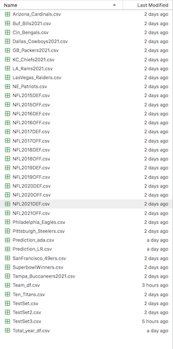
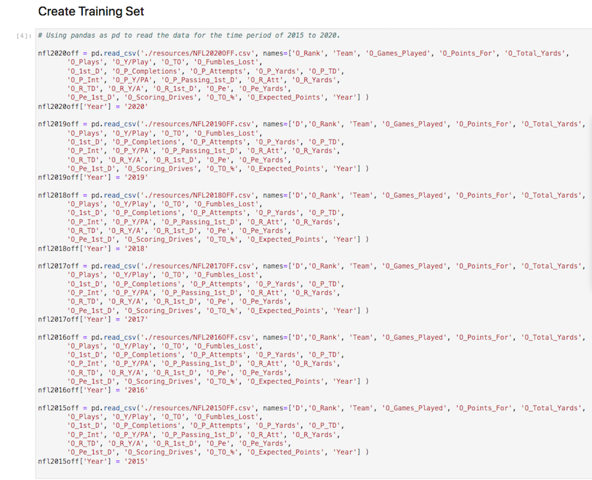
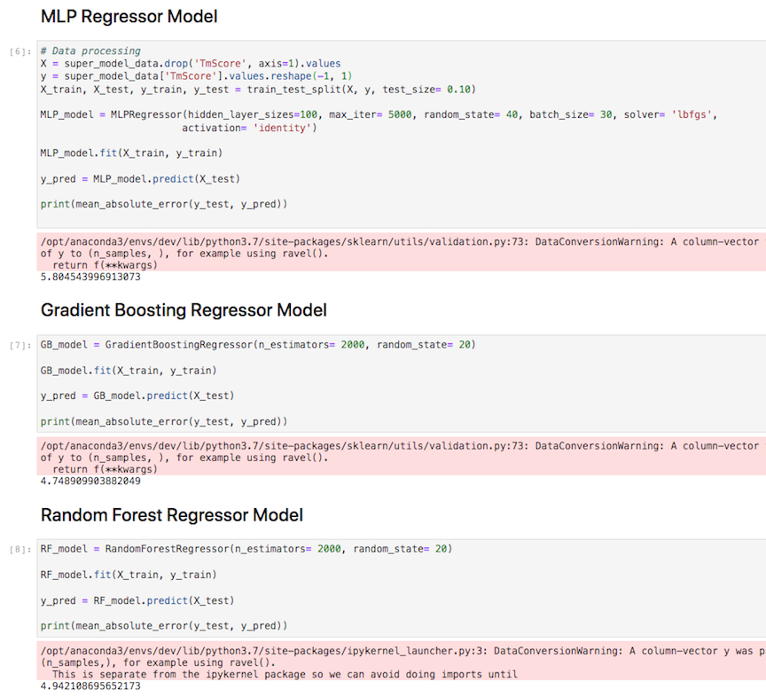
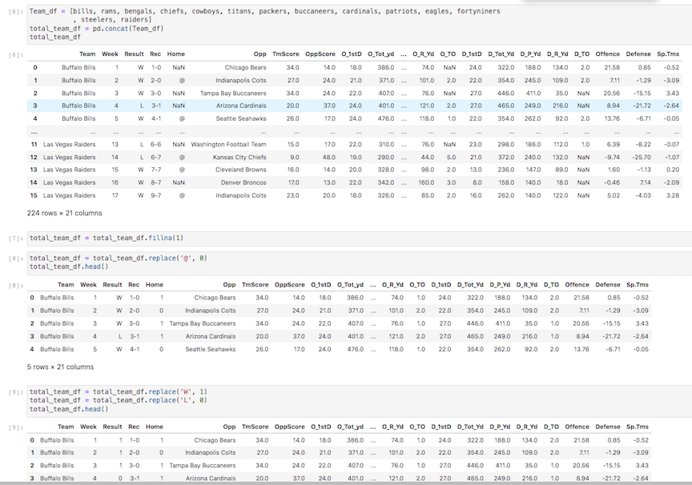
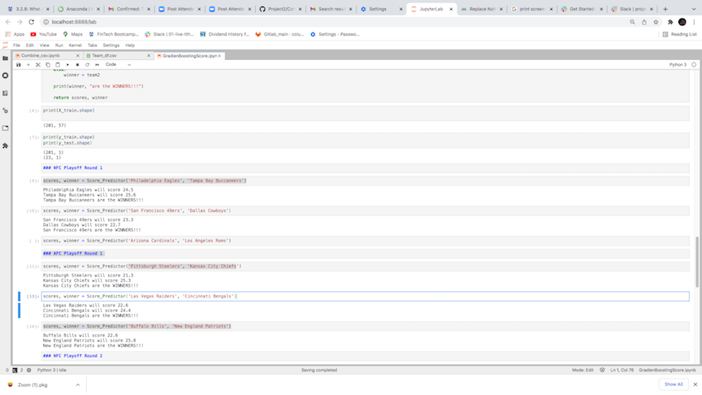
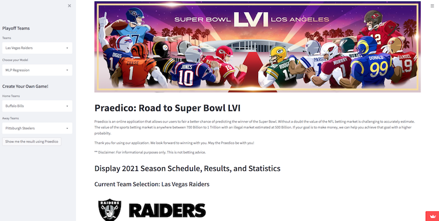
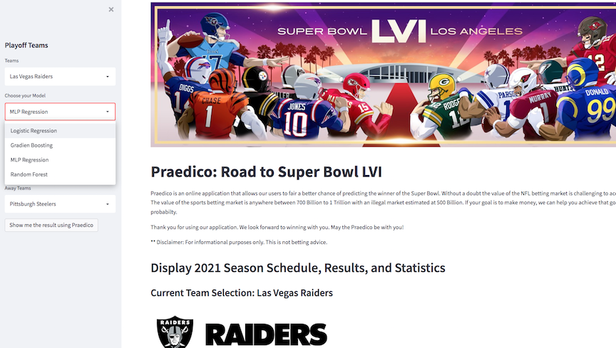
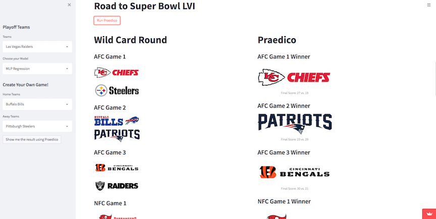

<!-- header is made with: https://github.com/kyechan99/capsule-render -->

[Bipasha Goswami](https://www.linkedin.com/in/bipasha-goswami-495b891a4/) 
[Briggs Lalor](https://www.linkedin.com/in/briggsclalor/) 
[Stephane Maysn](https://www.linkedin.com/in/stephane-masyn-35b16817a/) 
[John Sung](https://linkedin.com/in/john-sung-3675569) 
                                                             

---

### Table of Contents

* [Executive Summary](#executive-summary)
* [Requirements](#requirements)
* [Data](#data)
* [Visualization](#visualization)
* [User Experience](#user-experience)
* [Web Sources](#web-sources)
* [License](#license)  

---

## Executive Summary

Praedico is an online application that allows our users to fair a better chance of predicting the winner in the NFL game of football. Without a doubt the value of the NFL betting market is challenging to accurately estimate. However, a total of over 20 Billion US Dollars was expected to be legally wagered in the U.S. on the 2021 NFL and college football seasons, nearly tripling the 7.5 Billion US Dollars wagered in 2020. Coming into 2022, the fourth-largest US state in New York, joined the list of sports betting states on January 8, 2022. Sports betting is legal in 30 states now while 10 additional states are planning to legalize soon. 

Now that we explained why developed of our application, let's go into the methodology behind the building of the app. In our application, we used the CRISP-DM Methodology to help our team stay organized to come up with a solution that predicts the winner of the Super Bowl LVI. By reviewing the code, you will come to know where and how we came up with our secret sauce called the Praedico. 

In our MVP, we have created a user friendly dashboard using Steamlit to help users view stats, summary and overall predicitons using interchangeable machine learning models. As we continue to work on our application, we will look to include the ability to place a wager and add additional features like betting odds and weather components to enhance our user experience. 
Please enjoy and may the Praedico be with you!

---

## Requirements

This project leverages python 3.7 Streamlit and scikit-learn.

A [conda](https://docs.conda.io/en/latest/) environment with liabraries listed below and [Jupyter Notebook/Lab](https://jupyter.org/) are required to run the code.

The following library was used:

1. [Scikit Learn](https://scikit-learn.org/stable/index.html) - Scikit Learn or Sklearn is one of the most used Python libraries for Data Science, along with others like Numpy, Pandas, Tensorflow, or Keras.

2. [Streamlit](https://streamlit.io/) - Streamlit turns data scripts into shareable web apps in minutes.

Install the following librarie(s) in your terminal...

    pip install -U scikit-learn
    pip install streamlit
 
---

## Data

The CSV files used in our codes were mainly created from https://pro-football-reference.com

---

## Visualization

### Using offensive and deffensive categories to create training Set

### Evaluating the samples of Mean Abolute Error of three models shown  

### Dataframe Creation

### Showing the scores being predicted 

## Front end application images

### Select the team for analysis

### Choose the model

### Run the model for projection

### The WINNER is... 

---

## User Experience

Go to the Anaconda Prompt to launch JupyterLab by typing Jupyter Lab. To use this application simply clone the repository and run the NFL_Dashboard.py in your Jupyter Lab. Open a terminal and input streamlit run NFL_Dashboard.py or simply choose from the two options below.

Please experience Praedico for yourself. Choose between the following... 

1) CLICK https://share.streamlit.io/stefimaz/side_projects/NFL_Dashboard.py 

2) SCAN the QR Reader using the camera from your phone. 

---

## Web Sources

https://pro-football-reference.com

https://sportingnews.com

https://bloomberg.com

https://nfl.com

https://youtu.be/8emUyzczThY

https://www.youtube.com/watch?v=9DtrosZ3bsI&t=412s

---

## License

MIT

---

